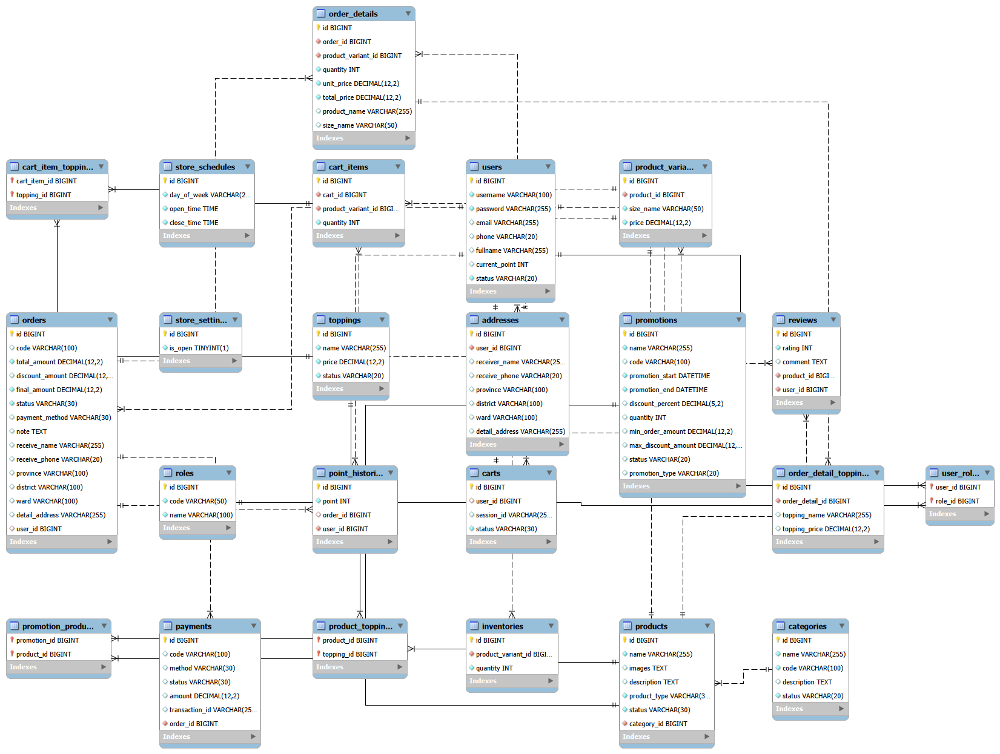

# DrinkGo - Hệ Thống Quản Lý Bán Hàng Cho Quán Nước
## Giới thiệu
DrinkGo là hệ thống quản lý bán hàng dành cho các quán nước, hỗ trợ khách hàng đặt hàng trực tuyến và giúp cửa hàng quản lý sản phẩm, đơn hàng, khách hàng, khuyến mãi và doanh thu.

Hệ thống được xây dựng theo kiến trúc Client - Server với Backend sử dụng Spring Boot và Frontend sử dụng ReactJS.
---
## Công nghệ sử dụng
### Backend
* Java
* Spring Boot
* Spring Security
* Spring Data JPA
* Hibernate
* Maven

### Frontend
* ReactJS
* JavaScript
* HTML/CSS

### Database
* MySQL

### Cache & Authentication
* Redis
* JWT Authentication

### Công cụ phát triển

* Git
* GitHub
* Postman
* IntelliJ IDEA

---

## Chức năng chính
### Xác thực và phân quyền
* Đăng ký tài khoản
* Đăng nhập
* Đăng xuất
* Refresh Token
* Đổi mật khẩu
* Quên mật khẩu
* Phân quyền theo Role (ADMIN, USER)

### Quản lý sản phẩm
* Xem danh sách sản phẩm
* Xem chi tiết sản phẩm
* Tìm kiếm sản phẩm
* Quản lý danh mục
* Quản lý kích thước sản phẩm
* Quản lý topping

### Giỏ hàng
* Thêm sản phẩm vào giỏ hàng
* Cập nhật số lượng sản phẩm
* Xóa sản phẩm khỏi giỏ hàng
* Xóa toàn bộ giỏ hàng
* Hỗ trợ giỏ hàng cho khách chưa đăng nhập

### Đơn hàng
* Tạo đơn hàng
* Theo dõi trạng thái đơn hàng
* Xem lịch sử đơn hàng
* Hủy đơn hàng
* Hỗ trợ đặt hàng không cần đăng nhập

### Thanh toán
* Thanh toán COD
* Thanh toán chuyển khoản
* Tích hợp VNPay (đang phát triển)
* Tích hợp MoMo (đang phát triển)

### Khuyến mãi và tích điểm
* Áp dụng mã giảm giá
* Quản lý chương trình khuyến mãi
* Tích điểm thưởng
* Đổi điểm lấy voucher

### Đánh giá sản phẩm
* Đánh giá sản phẩm
* Xem danh sách đánh giá
* Xóa đánh giá

### Dashboard quản trị
* Thống kê doanh thu
* Thống kê đơn hàng
* Sản phẩm bán chạy
* Quản lý khách hàng

---
## Tính năng nổi bật
* JWT Authentication và Authorization
* Role-Based Access Control (RBAC)
* Redis quản lý Refresh Token
* Hỗ trợ Guest Checkout
* Voucher và Loyalty Point System
* RESTful API theo chuẩn thực tế
* Dashboard thống kê doanh thu
* Thiết kế theo mô hình nhiều tầng (Layered Architecture)
---

## Kiến trúc hệ thống
```text
ReactJS Frontend
        │
        ▼
    RESTful API
        │
        ▼
Spring Boot Backend
        │
 ┌──────┴──────┐
 ▼             ▼
MySQL        Redis
```
---

## Cơ sở dữ liệu
### Các bảng chính
+ User (id, username, password, email, phone, fullname, status, currentpoint)
  Status = [ ACTIVE, INACTIVE, LOCKED]
+ Role (id, code, name)
+ Product (id, name, images, description, producttype, status, category_id)
  ProductType = [ MADE_TO_ORDER, READY_MADE]
  ProductStatus = [ ACTIVE, INACTIVE, OUT-OF-STOCK]
+ Productvariant (id, product_id, sizename, price)
+ Topping (id, name, price, status)
  Status = [ AVAILABLE, UNAVAILABLE]
+ Cart (id, user_id, sesson_id, status)
  Status = [ ACTIVE, CHECKED_OUT, ABANDONED]
+ CartItem (id, cart_id, product_variant_id, quantity, unitprice)
+ Category (id, name, code, description, status)
  Status = [ ACTIVE, INACTIVE]
+ StoreSetting( id, isopen)
+ StoreSchedule( id, dayofweek, opentime, closetime)
  DayOfWeek = [MONDAY, TUESDAY, WEDNESDAY, THURSDAY, FRIDAY, SATURDAY, SUNDAY]
+ Order (id, code, totalamount, discountamount, finalamount, status, paymentmethod, note, receivename, receivephone, province, district, ward, detailaddress, user_id)
  Status (PENDING, CONFIRMED, PREPARING, DELIVERING, COMPLETED, CANCELLED)
+ OrderDetail (id, order_id, quantity, product_variant_id, unitprice, totalprice, productname, sizename)
+ OrderDetailTopping (id, order_detail_id, toppingname, toppingprice)
+ Promotion (id, name, code, promotionstart, promotionend, discountpercent, quantity, minorderamount, maxdiscountamount, status, promotiontype)
  PromotionType = [ PRODUCT, ORDER, VOUCHER]
  Status = [ ACTIVE, INACTIVE, EXPIRED]
+ Payment (id, code, method, status, order_id, amount, transaction_id)
  Method = [ Cod, Momo, VNPay, Banking]
  Status = [ Pending, Success, Failed, Refunded]
+ Review (id, rating, comment, product_id, user_id)
+ PointHistory (id, point, order_id, user_id)
+ Address (id, user_id, receivername, receivephone, province, district, ward, detailaddress)

### Sơ đồ ERD





---

## Một số API tiêu biểu

### Authentication

```http
POST /api/v1/auth/login
POST /api/v1/auth/register
POST /api/v1/auth/refresh
POST /api/v1/auth/logout
```

### Product

```http
GET    /api/v1/products
GET    /api/v1/products/{id}
POST   /api/v1/admin/products
PUT    /api/v1/admin/products/{id}
DELETE /api/v1/admin/products/{id}
```

### Cart

```http
GET    /api/v1/cart
POST   /api/v1/cart/items
PUT    /api/v1/cart/items/{id}
DELETE /api/v1/cart/items/{id}
```

### Order

```http
POST   /api/v1/orders
GET    /api/v1/orders
GET    /api/v1/orders/{id}
DELETE /api/v1/orders/{id}
```

---

## Cài đặt dự án

### Clone source code

```bash
git clone https://github.com/DuongThun26/Drink-Go.git
```
## Cấu hình cơ sở dữ liệu

### 1. Tạo cơ sở dữ liệu MySQL

```sql
CREATE DATABASE drinkgo;
```

### 2. Cấu hình biến môi trường

Trước khi chạy ứng dụng, hãy cấu hình các biến môi trường sau:

| Biến môi trường | Mô tả                                  |
| --------------- | -------------------------------------- |
| DB_PASSWORD     | Mật khẩu MySQL                         |
| SECRETKEY       | Khóa bí mật dùng để ký và xác thực JWT |

Ví dụ:

```bash
DB_PASSWORD=your_mysql_password
SECRETKEY=your_secret_key
```

### 3. Cấu hình ứng dụng

Ứng dụng sử dụng file `application.yml` với cấu hình như sau:

```yaml
spring:
  datasource:
    url: jdbc:mysql://localhost:3306/drinkgo
    username: root
    password: ${DB_PASSWORD}

secretkey: ${SECRETKEY}
```

### Chạy Backend

```bash
mvn clean install
mvn spring-boot:run
```

### Chạy Frontend

```bash
npm install
npm run dev
```

---

## Hướng phát triển

* Tích hợp thanh toán VNPay
* Tích hợp thanh toán MoMo
* Docker Deployment
* CI/CD Pipeline
* Gửi Email thông báo đơn hàng
* Theo dõi trạng thái đơn hàng thời gian thực
* Ứng dụng Mobile

---